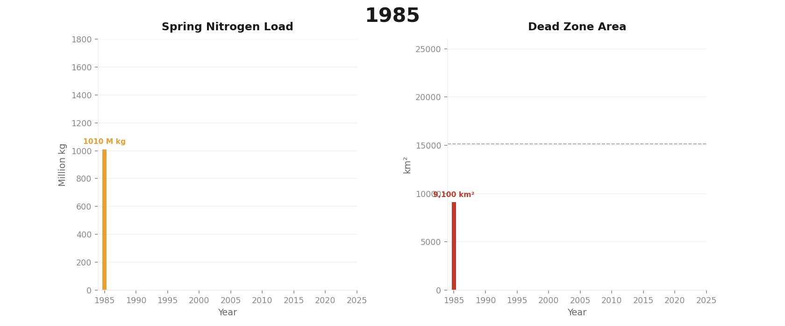

# Dead Zones on a Clock 🌊

> Every summer, an area the size of New Jersey suffocates in the Gulf of Mexico.



This project models the seasonal collapse and recovery of the Gulf of Mexico's hypoxic "dead zone" using 40 years of oceanographic data. It combines annual cruise measurements, river nutrient loading, and sea surface temperature to predict dead zone size and tell the story of how Midwest farming shows up in the ocean.

---

## What is a Dead Zone?

A hypoxic zone (dead zone) forms when dissolved oxygen drops below **2 mg/L**, too low to support fish, shrimp, or bottom-dwelling life. The Gulf of Mexico dead zone forms every summer near the Mississippi River delta, driven by nitrogen and phosphorus runoff from agriculture across 40% of the continental U.S.

Since 1985, NOAA and LUMCON scientists have measured its size every July. The average is roughly 5,200 km². The record was set in 2017 at 22,720 km², larger than New Jersey.

---

## Project Goals

- Build a 40-year timeseries of Gulf dead zone size (1985-2024)
- Engineer features from river nutrient loading and sea surface temperature
- Train a regression model to predict annual dead zone size
- Identify anomalous years and their causes (hurricanes, droughts, La Nina)
- Visualize the dead zone pulsing across decades with an animated chart

---

## Data Sources

| Dataset | Source | Variable |
|---|---|---|
| Annual dead zone size (1985-2024) | LUMCON / NOAA NCCOS | Area in km² |
| World Ocean Atlas 2023 | NOAA NCEI | Dissolved oxygen (µmol/kg) |
| Mississippi River nutrient flux | USGS | Spring nitrogen load |
| Sea surface temperature | NOAA OISST | Monthly SST (°C) |

---

## Project Structure

```
deadzone/
├── data/               # Raw data files (not tracked by git)
│   └── woa23_all_o00_01.nc
├── notebooks/
│   ├── 01_explore.ipynb        # Data loading and first look
│   ├── 02_features.ipynb       # Feature engineering
│   ├── 03_model.ipynb          # Regression and anomaly detection
│   └── 04_visualize.ipynb      # Animated charts and dashboard
├── outputs/            # Saved plots and exports
└── README.md
```

---

## Tech Stack

```
xarray       - multidimensional oceanographic arrays (NetCDF)
pandas       - tabular feature table
scikit-learn - Random Forest regression, anomaly detection
matplotlib   - static plots and animations
cartopy      - geographic map projections
```

---

## Key Findings

- **Strongest predictor**: Spring nitrogen load (r = 0.788). Sea surface temperature was much weaker at r = 0.196.
- **Model performance**: Random Forest with Leave-One-Out CV, R² = 0.52, MAE = 2,517 km²
- **Feature importance**: Nitrogen load accounts for 80.4% of model decisions, sea surface temperature 19.6%
- **Most anomalous years**: 2017 (record 22,720 km², extreme spring flooding), 2020 (Hurricane Hanna hit days before the survey cruise), 2018 (Hurricane Michael mixed the water column and broke up the zone)
- **Policy gap**: The 40-year mean of 15,154 km² is 3x larger than the Task Force 2035 target of 4,921 km²

---

## The Farm-to-Ocean Story

The dead zone is a direct consequence of industrial agriculture in the American Midwest. Nitrogen fertilizer applied to cornfields in Iowa and Illinois drains into the Mississippi, travels 1,500 miles south, and triggers algal blooms in the Gulf. When the algae die and decompose, they consume all available oxygen and suffocate everything on the seafloor.

This project traces the full causal chain: farm to river to ocean to dead zone.

---

## How to Run

```bash
# Clone the repo
git clone https://github.com/YOUR_USERNAME/deadzone.git
cd deadzone

# Create environment
conda create -n deadzones python=3.11
conda activate deadzones
conda install -c conda-forge xarray netcdf4 rasterio geopandas cartopy scipy numpy pandas matplotlib jupyter
pip install plotly dash streamlit scikit-learn xgboost seaborn

# Launch Jupyter
jupyter notebook
```

Open `notebooks/01_explore.ipynb` to start.

---

## Data Access

Raw NetCDF files are not tracked in this repo due to file size. Download them from:

- **NOAA World Ocean Atlas 2023**: https://www.ncei.noaa.gov/products/world-ocean-atlas-2023
- **NOAA OISST**: https://psl.noaa.gov/data/gridded/data.noaa.oisst.v2.html
- **USGS Nutrient Flux**: https://toxics.usgs.gov/hypoxia

Place downloaded files in the `data/` directory.

---

## References

- Rabalais, N.N. et al. (2002). *Beyond Science into Policy: Gulf of Mexico Hypoxia and the Mississippi River*. BioScience.
- Turner, R.E. and Rabalais, N.N. (1994). *Coastal eutrophication near the Mississippi River delta*. Nature.
- NOAA NCCOS Gulf of Mexico Hypoxia program: https://coastalscience.noaa.gov
- LUMCON Gulf Hypoxia: https://gulfhypoxia.net
